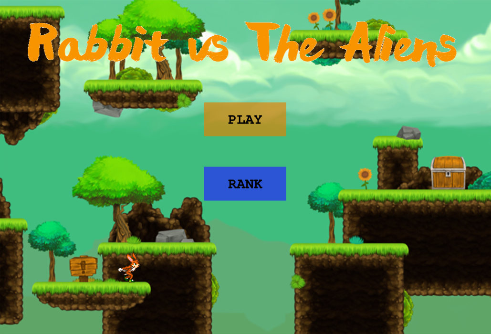
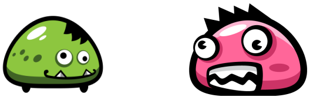

# Rabbit-Action_Game

Rabbit-Action is an HTML browser game made with Phaser3 and NPM. With requirements according to [The Microverse JS Capstone project](https://www.notion.so/RPG-game-f94a617841e240a293c0b6928beebe89)

## Built With 

- JavaScript
- Phaser3
- Webpack
- HTML5
- Jest

## Live Demo

[:globe_with_meridians::computer:](https://rabbit-action-game.netlify.app/)

## Getting Started

In order to start with this project you need the next:

1. Get a copy of this project [this repository :blue_book:](https://github.com/NewIncome/Rabbit-Action_Game)

Once you have cloned this project
1. Go to folder project 
2. Look for the `dist/index.html`
3. Use a live local server to load the html file
4. Or just use the Live Demo link

### Usage

- Once the game is open and loaded
- Click on the **PLAY** button
- Once the game has started, use the following keyboard keys

-> Left Arrow  :  to move left

<- Right Arrow  :  to move right

^ Up Arrow  :  to move up

[ ] Space key  :  to punch

### Game Stages/Phases

1. Beginning Stage
    - First, green mosters with low life will appear, after defeating them with a punch, starts stage 2
2. Second Stage
    - Pink Monsters will appear, less of them but with more life so you will have to hit them more times
3. Final Stage
    - The Boss will appear. He will be alone but you will need to hit him a lot more times because he is stronger. He will also always run from you after every punch
All the enemies, including the boss, will run al over at different speeds and when they fall of the land tiles they will respawn at the top

You will die and it will be game over if you fall off the tiles and into infinity, so be careful

## Future upgrades
- add music and sounds
- add playability in mobile devices
- add motion when player dies
- add motion when boss is killed
- add more levels

## Author

👤 **Jose Alfredo Cardenas**

- Github: [@Jose Alfredo](https://github.com/NewIncome)
- Twitter: [@J_A_fredo](https://twitter.com/J_A_fredo)
- LinkedIn: [Jose Alfredo Cardenas](https://www.linkedin.com/in/j-alfredo-c/)

## Acknowledgement

Inspiration from [Luzaks project](https://github.com/Luzaks/ShooterGame)
### Special Thanks
- [OpenGameArt](https://opengameart.org/) for the links to great free resources
- [LudicArts](https://www.ludicarts.com/) for the excellent background and tileSet shared
- [Bevouliin](http://bevouliin.com) for the great Enemies they made and share for free
- and for the Hero, the base player: Art by Stephen **"Redshrike"** Challener and the [OpenSurge Team](http://opensnc.sourceforge.net). Commissioned by [OpenGameArt.org](http://opengameart.org)

## 🤝 Contributing

Contributions, issues, and feature requests are welcome!

## Show your support

If you got until here, show your love hitting the ⭐️ button, greatly appreciated.

## 📝 License

This project is [MIT](LICENSE) licensed